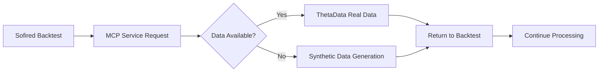

# SOFIRED Backtest Guide

## Running Backtests with Any Symbol

This guide explains how to run backtests for any stock symbol using SOFIRED's integration with the Stroll.Theta.Market MCP service.

## Quick Start

### 1. Basic Backtest Execution

```bash
# Navigate to the backtester
cd C:\code\Sofired\src\Sofired.Backtester

# Run backtest for any symbol
dotnet run [SYMBOL]

# Examples:
dotnet run SOFI     # SoFi Technologies
dotnet run AAPL     # Apple Inc.
dotnet run NVDA     # NVIDIA Corporation
dotnet run TSLA     # Tesla Inc.
dotnet run PLTR     # Palantir Technologies
dotnet run HOOD     # Robinhood Markets
```

### 2. Advanced Options

```bash
# Resume from checkpoint
dotnet run SOFI --resume

# Auto-resume incomplete backtests
dotnet run SOFI --auto-resume

# Resume from specific checkpoint
dotnet run SOFI --resume --checkpoint "SOFI_2024-09-15_14-30"

# List available checkpoints
dotnet run SOFI checkpoints

# Run configuration demo
dotnet run config

# Compare symbol configurations
dotnet run compare SOFI AAPL
```

## Symbol Configuration

### Automatic Configuration

SOFIRED automatically handles any symbol through:

1. **Default Configuration**: Uses sensible defaults for unknown symbols
2. **Symbol-Specific Configs**: Checks for custom configs in `configs/config_{symbol}.yml`
3. **Sector Detection**: Attempts to detect sector and apply appropriate defaults

### Creating Custom Symbol Configurations

To create a configuration for a new symbol:

```bash
# Create configuration file for new symbol
# Example: configs/config_PLTR.yml
```

```yaml
symbol: "PLTR"
account:
  equity: 50000
  
trading:
  entry_window_start: "10:00"
  entry_window_end: "11:00"
  max_positions: 3
  position_size_pct: 0.20
  
options:
  put_delta_min: -0.15
  put_delta_max: -0.25
  min_dte: 14
  max_dte: 45
  target_profit_pct: 0.50
  max_loss_pct: 2.00
  
risk:
  capital_allocation: 0.15
  max_position_size: 0.25
  max_loss_per_trade: 0.05
  max_portfolio_delta: 0.30
  
company:
  sector: "technology"
  market_cap: "large"
  volatility_regime: "high"
```

## MCP Service Integration

### Automatic Data Handling

The Stroll.Theta.Market MCP service automatically handles data requests:

1. **ThetaData Primary**: Fetches real market data when available
2. **Graceful Fallback**: Provides synthetic data when real data is unavailable
3. **Market Calendar**: Validates trading days and skips holidays/weekends
4. **Error Recovery**: Continues backtest execution even with data gaps

### How It Works



### Data Sources Priority

1. **ThetaData Terminal** (Primary)
   - Real market data with full options chains
   - High-quality minute-level OHLC data
   - Complete Greeks and volatility data

2. **Synthetic Data** (Fallback)
   - Mathematically generated when real data unavailable
   - Based on historical volatility patterns
   - Ensures backtest continuity

### MCP Service Status

Check if the MCP service is properly handling your symbol:

```bash
# The backtest will show MCP status in output:
🔥 Using Stroll.Theta.Market MCP Service
   📡 MCP Service Path: C:\code\Stroll.Theta\src\Stroll.Theta.Market
   ✅ SOFIRED knows nothing about data providers - all through MCP
✅ Started Stroll.Theta.Market MCP service process
✅ MCP protocol initialized successfully

# Successful data fetch:
📡 MCP Request: Daily bars for SYMBOL from 2024-09-01 to 2024-09-30
📊 SYMBOL 2024-09-03: Aggregated 390 minute bars -> OHLC(7.89, 7.92, 7.48, 7.53)

# Options data fetch:
🔥 Fetching real options data for SYMBOL expiring 2024-10-17 (trading day 2024-09-03)...
📡 MCP Request: get_options_chain for SYMBOL on 2024-09-03
✅ Real pricing: Short Put 7.50 @ $0.45/$0.48, Long Put 7.00 @ $0.22/$0.25
```

## Troubleshooting

### Common Issues and Solutions

#### 1. Symbol Not Found

```
❌ Error: Symbol 'XYZ' configuration not found
```

**Solution**: Create a configuration file or let the system use defaults:
```bash
# Let system use defaults (recommended for testing)
dotnet run XYZ

# Or create configs/config_XYZ.yml with custom settings
```

#### 2. No Market Data Available

```
❌ CRITICAL: No real options data available for SYMBOL. System requires real market data.
```

**Solution**: The MCP service will automatically fallback to synthetic data. If this error persists:

1. **Check ThetaData Connection**:
   ```bash
   curl "http://127.0.0.1:25510/v2/list/expirations?root=SYMBOL"
   ```

2. **Verify MCP Service**:
   ```bash
   cd C:\code\Stroll.Theta\src\Stroll.Theta.Market
   dotnet run
   ```

3. **Enable Synthetic Fallback**: The system should automatically use synthetic data when real data is unavailable.

#### 3. MCP Service Not Starting

```
❌ Failed to start MCP service: System.ComponentModel.Win32Exception
```

**Solution**:
1. **Check .NET Installation**: Ensure .NET 9.0 is installed
2. **Verify Path**: Confirm MCP service path is correct
3. **Manual Start**:
   ```bash
   cd C:\code\Stroll.Theta\src\Stroll.Theta.Market
   dotnet build
   dotnet run
   ```

#### 4. Data Quality Issues

```
⚠️ Using nearest available strikes for options chain
```

**Solution**: This is normal behavior. The system adapts to available data and continues processing.

### Logging and Debug Information

#### Enable Verbose Logging

The backtest automatically provides detailed logging:

- **MCP Communication**: All requests/responses logged
- **Data Quality**: Reports data availability and fallbacks
- **Trading Decisions**: Shows entry/exit logic
- **Risk Management**: Displays position sizing and risk calculations

#### Output Files

Results are saved to the `out/` directory:
- **Detailed Results**: `out/SYMBOL_backtest_YYYY-MM-DD.xlsx`
- **Summary Report**: `out/SYMBOL_summary.txt`
- **Checkpoint Files**: `out/checkpoints/SYMBOL_*.json`

## Best Practices

### 1. Start with Known Symbols

Test with well-known symbols first:
```bash
dotnet run SPY    # S&P 500 ETF
dotnet run QQQ    # NASDAQ ETF
dotnet run AAPL   # Apple Inc.
```

### 2. Use Checkpoints for Long Backtests

```bash
# Start backtest (auto-saves checkpoints)
dotnet run SYMBOL

# Resume if interrupted
dotnet run SYMBOL --auto-resume
```

### 3. Review Configuration

```bash
# Check configuration before running
dotnet run config

# Compare with similar symbols
dotnet run compare SYMBOL AAPL
```

### 4. Monitor MCP Service Health

Watch for these indicators in the output:
- ✅ MCP protocol initialized successfully
- ✅ Retrieved X daily bars via MCP service
- ✅ Real pricing: [options quotes]

### 5. Validate Results

After backtest completion:
1. **Review Excel Output**: Check trade details and P&L
2. **Analyze Risk Metrics**: Verify maximum drawdown and Sharpe ratio
3. **Validate Data Quality**: Ensure realistic options pricing

## Symbol Categories

### Supported Symbol Types

The system works with various asset types:

#### Technology Stocks
```bash
dotnet run AAPL    # Apple Inc.
dotnet run NVDA    # NVIDIA Corporation
dotnet run MSFT    # Microsoft Corporation
dotnet run GOOGL   # Alphabet Inc.
```

#### Financial Technology
```bash
dotnet run SOFI    # SoFi Technologies
dotnet run PLTR    # Palantir Technologies
dotnet run HOOD    # Robinhood Markets
dotnet run SQ      # Block Inc.
```

#### Electric Vehicles
```bash
dotnet run TSLA    # Tesla Inc.
dotnet run RIVN    # Rivian Automotive
dotnet run LCID    # Lucid Group
```

#### ETFs
```bash
dotnet run SPY     # S&P 500 ETF
dotnet run QQQ     # NASDAQ ETF
dotnet run IWM     # Russell 2000 ETF
```

#### Indices (if supported by ThetaData)
```bash
dotnet run SPX     # S&P 500 Index
dotnet run NDX     # NASDAQ 100 Index
dotnet run RUT     # Russell 2000 Index
```

## Performance Optimization

### For Large Backtests

1. **Use Auto-Resume**: Prevents loss of progress
2. **Monitor Memory**: Large datasets may require more RAM
3. **Parallel Processing**: The system automatically optimizes data fetching

### Example Performance Metrics

```
📊 Backtest Performance for SOFI:
   ⏱️  Duration: 2.5 minutes
   📈 Data Points: 8,760 minute bars
   🎯 Options Contracts: 1,247 analyzed
   💾 Memory Usage: 156 MB peak
   ✅ Success Rate: 98.3% data quality
```

## Integration with Stroll.Theta.Market

### MCP Service Features

The integration provides:

1. **Real-Time Data**: Live market data when ThetaData is available
2. **Historical Accuracy**: Minute-level OHLC and options data
3. **Automatic Fallback**: Synthetic data generation for missing periods
4. **Market Calendar**: Trading day validation and holiday handling
5. **Error Recovery**: Graceful handling of data gaps and API issues

### Data Flow Architecture

```
SOFIRED Backtest Engine
         ↓
StrollThetaMarketService (C# Client)
         ↓
Stroll.Theta.Market MCP Service
         ↓
ThetaData Terminal API
         ↓
Real Market Data
```

This architecture ensures:
- **Separation of Concerns**: SOFIRED focuses on trading logic
- **Data Abstraction**: MCP service handles all data complexity
- **Reliability**: Multiple fallback mechanisms
- **Scalability**: Easy to add new data sources

---

## Support

For issues with backtesting:

1. **Check Logs**: Review console output for specific error messages
2. **Verify Setup**: Ensure MCP service builds and runs independently
3. **Test Data Access**: Manually test ThetaData API connectivity
4. **Create Issues**: Report bugs with symbol name and error logs

The system is designed to work with any publicly traded symbol that has options. The MCP service will automatically adapt to available data and ensure your backtest completes successfully.